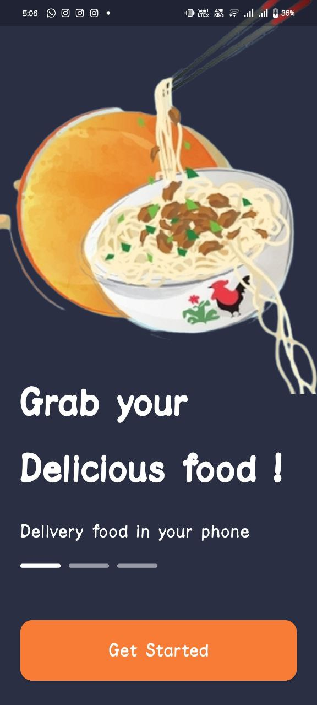
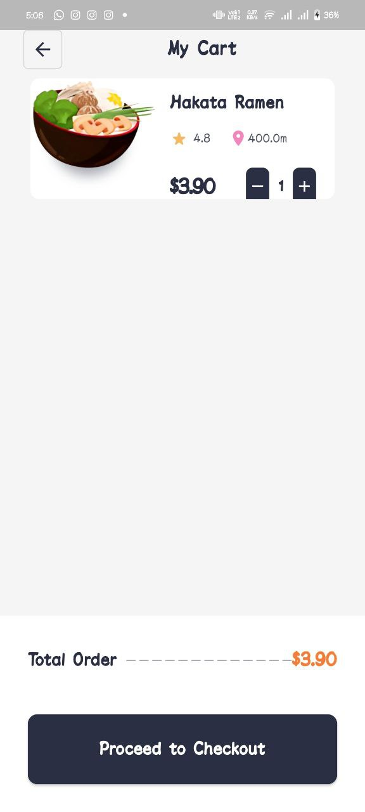
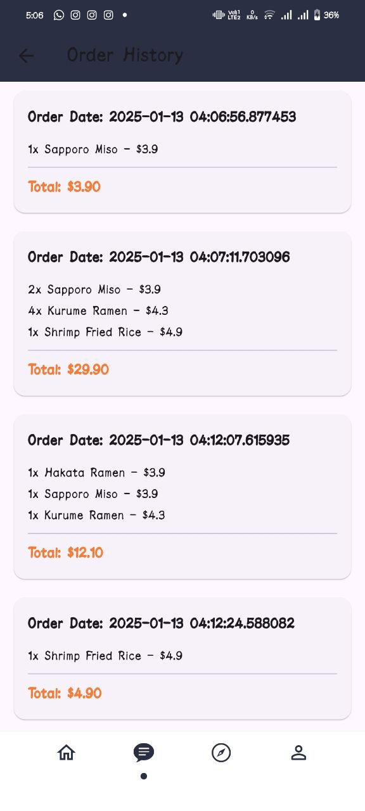

# 🍴 Food Ordering App


A fully functional **Food Ordering App** built with Flutter! This app allows users to browse food items, filter by category, search products, and manage a cart with a seamless ordering experience.

---

## 📱 **Features**

- **Dynamic Categories**: Categories are dynamically generated based on product data.
- **Search Functionality**: Easily search food items by name.
- **Location Services**: Automatically fetch the user's location using geolocation.
- **Product Filtering**: Filter products by category or search query.
- **Cart Management**: Add, remove, and update items in the cart.
- **Order History**: View past orders saved persistently using `SharedPreferences`.
- **Onboarding Screens**: Welcome new users with an onboarding flow.
- **Interactive UI**: Smooth animations and responsive design.

---

## 🛠 **Tech Stack**

- **Flutter**: Framework for building natively compiled apps.
- **Provider**: State management for dynamic UI updates.
- **SharedPreferences**: Persistent storage for cart and order history.
- **Geolocator**: Retrieve user location.
- **Geocoding**: Convert coordinates to human-readable addresses.
- **Animate_Do**: Add animations to widgets for a better user experience.

---

## 📂 **Project Structure**

```plaintext
lib/
├── main.dart               # App entry point
├── consts.dart             # Constants for colors and styles
├── Model/                  # Data models
│   ├── product_model.dart  # Product data structure
│   ├── cart_model.dart     # Cart item data structure
│   ├── onboard_model.dart  # Onboarding data structure
│   └── bottom_icon_model.dart  # Bottom navigation icon data
├── Provider/               # State management
│   └── cart_provider.dart  # Cart and order history logic
├── View/                   # Screens
│   ├── home_page.dart      # Home screen
│   ├── cart_screen.dart    # Cart screen
│   ├── order_history.dart # Order history screen
│   ├── onboard_page.dart  # Onboarding screen
│   ├── order_summary_screen.dart # Order summary screen
│   └── main_page.dart      # Main navigation page
├── Widgets/                # UI components
│   ├── food_product_items.dart  # Product display widget
│   └── cart_items.dart     # Cart item widget
└── assets/                 # Images and assets
    ├── ramen/             # Ramen product images
    ├── burger/            # Burger product images
    ├── salad/             # Salad product images
    ├── waffle/            # Waffle product images
    ├── thali/             # Thali product images
    ├── biryani/           # Biryani product images
    └── onboard_*.png      # Onboarding images
```

---

## 🖼 **Screenshots**

| Onboarding Screen | Home Screen | Cart Screen |  Order Summery |
| :----------------: | :---------: | :---------: | :---------: |
|  |  |  |  |
## 🚀 **How to Run**

1. **Clone the Repository**:
   ```bash
   git clone https://github.com/yourusername/food-ordering-app.git
   cd food-ordering-app
   ```

2. **Install Dependencies**:
   ```bash
   flutter pub get
   ```

3. **Run the App**:
   ```bash
   flutter run
   ```

---

## 🎨 **UI Highlights**

- **Onboarding**: Welcome screens for new users.
- **Home Screen**: Display categories and products.
- **Order Summary**: Review selected items before finalizing the order.

---

## 🔧 **Customizations**

1. **Add New Products**:
   - Update the `product_model.dart` file with new items and categories.
   
2. **Change Theme**:
   - Modify the `consts.dart` file for custom colors.
   
3. **Integrate Backend**:
   - Replace the static data with API calls to fetch real-time product data.

---

## 📄 **License**

This project is licensed under the MIT License. See the LICENSE file for details.

---

## 👨‍💻 **Contributors**

- **Your Name** - Creator and Maintainer  
  Feel free to open issues or pull requests for new features or bug fixes!

---

### **How to Use**

- Save this as `README.md` in your project’s root directory.
- Replace the placeholder GitHub repository URL (`yourusername/food-ordering-app.git`) with your own URL.
- Replace `assets/onboard_example.png` with the actual paths to your images.
- Add a `LICENSE` file if you plan to use the MIT license or any other license.

Let me know if you need help with screenshots, further customizations, or anything else!
